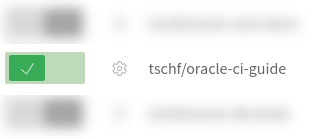
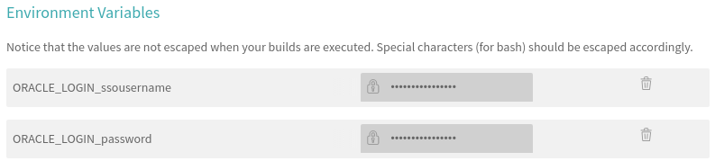

# oracle-ci-test

1. Go to `travis-ci.org` (or .com if you're setting it up for private projects) and sign in with GitHub - there's a login button at the top right corner.


There you will be prompted to authorize access to your account.

If this is the first time accessing travis ci, you will be presented with a getting started page, that you need to go to your profile in order to activate the repository you want integrated.

You can get to your profile by clicking the `+` sign at the left hand panel next to the header `My Repositories`.


On your profile, you will see your repositories, and can enable/disable repositories. So, flick on the repository you are hoping to integrate.  



The next task you will want to do is add the build status to your README, so users are aware of the current status. The format of this icon is `https://github.com/owner/repo.svg`, where owner is the user or organisation that the repo belongs to, and repo is the name of the repository. So, for this repository, the build status icon is: `https://travis-ci.org/tschf/oracle-ci-guide.svg`


Now, the build process requires access to your OTN credentials in order to download the database RPM file - so, that goes without saying that wou would be accepting OTN's terms of service - particularly for Oracle XE.

So, after enabling your repository, click the cog icon to the left of the repository name as can be seen above. On the settings page, add the following environment variables:

* ORACLE_LOGIN_ssousername
* ORACLE_LOGIN_password

When you click the `Add` button, you will want to leave `Display value in the build log` set in the `OFF` position (so no what can get your credentials). After that's done, the settings page should appear like so.



This project on GitHub - https://github.com/cbandy/travis-oracle - has all the necessary steps and code to integrate it into your project, but you will want to add a folder in your project to place them all. This can be done with:

```bash
wget 'https://github.com/cbandy/travis-oracle/archive/v2.0.0.tar.gz'
mkdir -p .travis/oracle
tar xz --strip-components 1 -C .travis/oracle -f v2.0.0.tar.gz
rm v2.0.0.tar.gz
```

(but I'm sure you can figure out another way if this doesn't suit)

When you compile source code in SQL*Plus, it doesn't return an exit code. One work around for this is to build a validation script that will raise an error if any of the packages you compile of a `status` of `INVALID`.

So, first you can add a check SQL script, similar to:

```sql
set verify off

whenever sqlerror exit failure

declare
    l_obj user_objects%rowtype;
begin
    select *
    into l_obj
    from user_objects
    where object_name = upper('&1');

    if l_obj.status = 'INVALID'
    then
        raise_application_error(
            -20000,
            '&1 did not compile successfully'
        );
    end if;

end;
/

exit

```

Because we have the `whenever sqlerror exit failure` clause, when raising the application error, we get a non-zero return code.

So, in our foo package, we added a check to the bottom so that after running, the exit code is non-zero. These checks could be added to a separate script so that you can test all the object you compile after the installation script.

foo.sql:
```sql
create or replace package foo
as

    bar NUMBER := 1;

end foo;
/

@check FOO
```

Finally, we wrap this to be executed from a bash script:

test.sh
```sh
#!/bin/bash
cd example
${ORACLE_HOME}/bin/sqlplus -S -L scott/tiger @foo.sql

FOO_RETURN=$?

if [[ ${FOO_RETURN} -ne 0 ]]; then
    exit ${FOO_RETURN}
fi
```

sqlplus connects with a test user (`scott`), that we set up in our `.travis.yml` that you can see below. After running the SQL*Plus script, we exit with the result of the script.

So, the `.travis.yml` will end up looking somewhat like this:

```yml
sudo: required

notifications:
  email: false

env:
  global:
    - ORACLE_COOKIE=sqldev
    - ORACLE_FILE=oracle11g/xe/oracle-xe-11.2.0-1.0.x86_64.rpm.zip
    - ORACLE_HOME=/u01/app/oracle/product/11.2.0/xe
    - ORACLE_SID=XE

before_install:
  - .travis/oracle/download.sh
  - .travis/oracle/install.sh

before_script:
  - >
    { echo "CREATE USER scott IDENTIFIED BY tiger;";
      echo "GRANT CONNECT, RESOURCE to scott;";
    } | "$ORACLE_HOME/bin/sqlplus" -L -S / AS SYSDBA

script:
  - ./test.sh
```

Happy testing...
